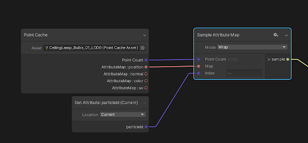

# Sample Attribute Map

> [!IMPORTANT]
> This feature is experimental. To use this feature, open the **Preferences** window, go to the **Visual Effects** tab, and enable **Experimental Operators/Blocks**.

**Menu Path : Operator > Sampling > Attribute Map**

The Sample Attribute Map Operator enables you to sample an [attribute map](point-cache-in-vfx-graph.md#attribute-map) from a [Point Cache](point-cache-in-vfx-graph.md).

This Operator takes an attribute map and an index and outputs the value of the attribute at the index. This Operator also takes the number of points in the Point Cache. **Warning**: This Operator requires the number of points to work. If you don't input the number of points, or input an incorrect value, this Operator doesn't sample the attribute map correctly.

Depending on the attribute map, the output attribute value type changes. You must explicitly specify the output type for this Operator or it produces undefined behavior. For information on how to do this, see [Operator configuration](#operator-configuration).

### Operator settings

| **Input** | **Description**                                              |
| --------- | ------------------------------------------------------------ |
| **Mode**  | The wrap mode to use if the value of **Index** is out of range for the **Map**. The options are:  &#8226; **Clamp**: Clamps the index between the first and last index of the **Map**. &#8226; **Wrap**: Wraps the index around to the other side of the **Map**. &#8226; **Mirror**: Mirrors the vertex list so out of range indices move back and forth through the **Map**. |

### Operator properties

| **Input**       | **Type**  | **Description**                                              |
| --------------- | --------- | ------------------------------------------------------------ |
| **Point Count** | uint      | The number of points present in the Point Cache              |
| **Map**         | Texture2D | The attribute map that contains a field of the Point Cache. For example, the positions of each point. |
| **Index**       | uint      | The index of the point to sample.                            |

| **Output** | **Type**                                | **Description**                                              |
| ---------- | --------------------------------------- | ------------------------------------------------------------ |
| **Sample** | [Configurable](#operator-configuration) | The content of the attribute map of the point specified by the input Index. **Warning**: You must explicitly specify the **Type** for this property so that it matches the type stored in the attribute map. For information on how to do this, see [Operator configuration](#operator-configuration). |

## Operator configuration

To view this Operator’s configuration, click the cog icon in the Operator’s header. You can choose a type for the output from the [Available Types](#available-types).

### Available types

You can use the following types for your input ports:

- bool,
- uint,
- int,
- float,
- Vector2,
- Vector3,
- Vector4
