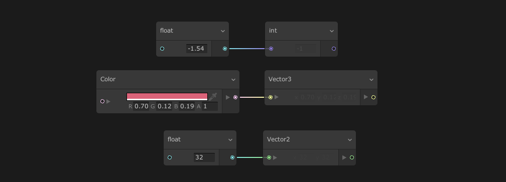

## Properties

Properties are editable fields that you can connect to graph elements using [Property workflow](GraphLogicAndPhilosophy.md). They can be found on graph elements such as  [Contexts](Contexts.md),  [Blocks](Blocks.md) and [Operators](Operators.md).

## Using Properties

Properties appear on graph elements, and change their value according to their actual value in the graph. When you connect another property to a property port, the graph element displays the computed value of the connected property.

After disconnecting a connected property, the field reverts to the previously set property value.

## Property Types

Properties in Visual Effect Graph can be of any Type, including the following:

* boolean
* integer
* float
* Vectors
* Textures
* AnimationCurve
* Gradient

### Accessing Property Components

Properties that are made of multiple components (such as Vectors, or Colors) can display every component individually in order to connect these to other properties of compatible type. Use the arrow next to the property to unfold the components.

### Casting Properties

Properties can connect between base types to perform a cast. Casts change the data type you are working on in order to inherit its properties. For example, if you cast a float to integer, the float can use integer division.

Casting from one type to another abides with the following rules:

* All Casting rules from HLSL apply:
  * Except Boolean types that cannot be cast.
  * Scalars will cast into vectors by setting all components.
* Vectors cast into vectors of lesser size by taking only the first N components.

### Compound Property Types

Compound Property Types are made from base data types. These types describe more complex data structures. For example, a Sphere is composed of a Position (Vector3) and a radius (float).

Expand Compound Property Types to access their components.

### Spaceable Properties

Spaceable Properties are Property Types that carry **Space information** (Local/World) with its value. This information is used by the graph to perform automatic space transformations when required.

Click on the Space Modifier to the left of the Property Field to change it.

For Example, a Position type carries a Vector3 value and a Spaceable Property. If you set the Spaceable Property to Local [0,1,0], this tells the graph that we refer to the 0,1,0 value in local space.

Depending on the [System Simulation Space](Systems.md#system-spaces), the value will be automatically transformed to the simulation space if required.

> [!TIP]
> You can use the Change Space Operator to manually change a Property Space.

## Property Nodes

Property Nodes are [Operators](Operators.md) that give access to Graph-Wide Properties defined in the [Blackboard](Blackboard.md). These properties allow you to reuse the same value throughout the graph at different places.

* Property Nodes display a Green dot left to the Property name if the property is exposed.
* To create a Property Node:
  * Drag the Node from the Blackboard Panel into the Workspace.
  * Open the Right Click context menu, open the **Create Node** menu and select the desired property from the Property category.
* To convert a Property Node to an Inline Node of the same type, right-click the property Node and select **Convert to Inline**
* When you delete a property from the Blackboard, Unity also deletes its property Node instances from the graph.
